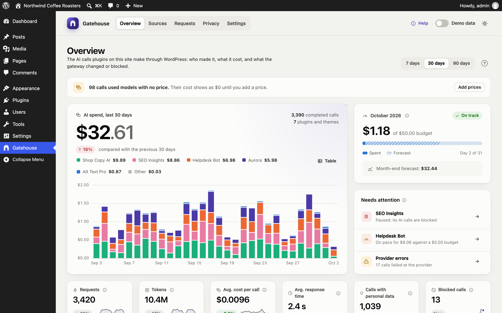

# Gatehouse documentation

Gatehouse shows you what each plugin on your site spends on AI, stops spending with budgets and hourly limits, and shows which plugins send personal data to AI providers.

## Start here

- **[Try the live demo](https://george-stathopoulos.github.io/gatehouse/demo/)**: Gatehouse with three months of sample data, in your browser.
- **[Getting started](getting-started.md)**: requirements, installation, the setup guide, demo data and the in-plugin Help.

## Using Gatehouse

| Page | What it covers |
|---|---|
| [Overview](overview.md) | The dashboard: spend, forecast, budget status, what needs attention, charts and recent activity |
| [Sources and budgets](sources-and-budgets.md) | Every plugin and theme that uses AI: budgets, hourly limits, pausing, redaction |
| [Requests](requests.md) | The log of every AI call Gatehouse sees, its filters and the detail panel |
| [Privacy](privacy.md) | Which plugins send personal data, redaction per plugin, and the AI data map |
| [Settings](settings.md) | Site-wide budget and hourly limit, alerts, logging, model prices and clearing data |

## Reference

- **[How costs are calculated](costs-and-pricing.md)**: the cost formula, where prices come from, and what isn't counted.
- **[Your data](data.md)**: what Gatehouse stores, for how long, and what uninstalling removes.
- **[FAQ](faq.md)**
- **[Troubleshooting](troubleshooting.md)**
- **[For developers](developers.md)**: how the gateway works, filters, WP-CLI and the REST API.
- **[Local AI with WebLLM](local-ai.md)**: a small model in your browser, for development sites and experiments.

## What Gatehouse can and can't see

Gatehouse sees two kinds of AI calls:

- **WordPress AI Client.** Plugins and themes that use the AI Client built into WordPress 7.0 (`wp_ai_client_prompt()`).
- **Direct calls.** Plugins that call Anthropic, OpenAI, Google, OpenRouter, xAI, Mistral, DeepSeek, Groq or Perplexity themselves, with their own API key, through WordPress's HTTP functions.

It can't see plugins that send AI requests to **their own service** (many SEO, page builder and form plugins work this way), or that bypass WordPress's HTTP functions. No WordPress plugin can.

## Gatehouse in one minute

1. A plugin asks for AI, for example to write a product description.
2. Gatehouse notes which plugin is asking. If that plugin is paused, over its budget or over its hourly limit, the request stops here, before anything is sent or charged.
3. Gatehouse checks the request for personal data and records what kind it found. If you turned on redaction for that plugin, the values are replaced with placeholders such as `[EMAIL_1]`.
4. The AI provider answers. If anything was replaced, Gatehouse puts the real values back before the plugin gets the answer.
5. The call is logged with its plugin, model, tokens, estimated cost, response time and the kinds of personal data it contained.

The plugins themselves need no setup.
