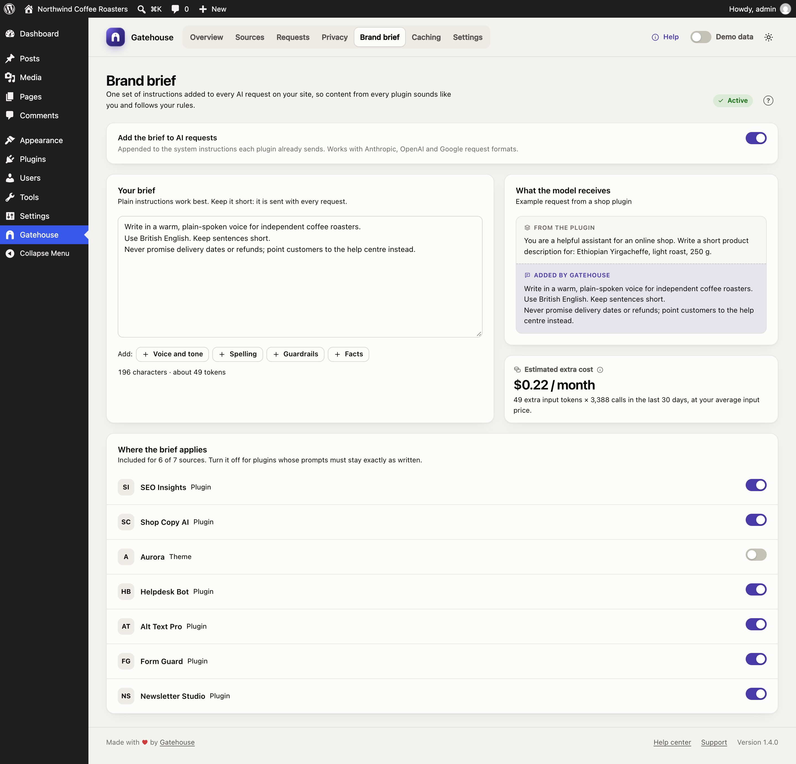

# Brand brief

Each AI plugin writes its own instructions for the AI model, so content from different plugins can sound different and follow different rules. The brand brief is one set of instructions that Gatehouse adds to **every** AI request on your site.

## Turning it on

Switch on **Add the brief to AI requests**, write your brief and click **Save changes**. The pill at the top right shows **Active** when the brief is on and not empty.

## Writing a good brief

Keep it short and plain: it is sent with every request, and you pay for those tokens each time.

Good things to include:

- **Voice and tone:** "Write in a warm, plain-spoken voice. Prefer short sentences."
- **Spelling:** "Use British English spelling."
- **Guardrails:** "Never promise refunds, delivery dates or discounts. Point customers to the help centre instead."
- **Facts:** "Do not invent product features, prices or statistics."

The **+ Voice and tone**, **+ Spelling**, **+ Guardrails** and **+ Facts** buttons add a starter line for each, which you can edit.

Avoid long background documents, product catalogues or formatting rules meant for one specific plugin.

## What the model receives

The preview shows an example request from a shop plugin. The plugin's own instructions come first, then your brief, labelled **Added by Gatehouse**.

The brief is **added after** the plugin's instructions; it never replaces them. Gatehouse places it where each provider expects instructions:

| Provider | Where the brief goes |
|---|---|
| Anthropic | The `system` prompt |
| OpenAI (Responses API) | `instructions` |
| OpenAI-compatible chat | A system message |
| Google Gemini | `systemInstruction` |

## Estimated extra cost

The brief adds tokens to every request. Gatehouse estimates the monthly cost as:

*brief tokens × completed calls in the last 30 days × your average input price.*

The token count is an estimate of about four characters per token. In the example above, a 196-character brief across about 3,400 calls a month adds roughly $0.22 a month.

## Where the brief applies

The list at the bottom shows every source. Switch the brief off for plugins whose prompts must stay exactly as written, such as translation, code generation or data extraction. This is the same setting as **Skip brand brief** in a source's [policy](sources-and-budgets.md#skip-brand-brief).

## Checking it works

In the [Requests](requests.md) log, the speech-bubble icon in the **Gateway** column lights up for calls that received the brief. The request details say **Brand brief: Added**.
