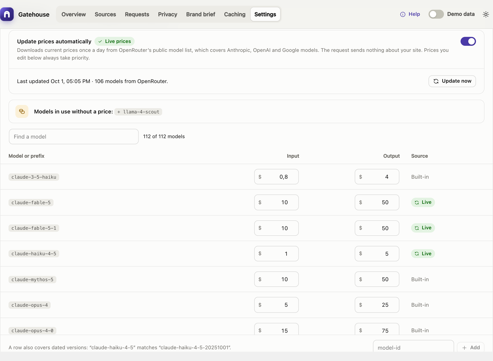

# How costs are calculated

All costs in Gatehouse are **estimates**. Your AI provider's invoice is always the source of truth.

## The formula

For each completed call:

```
cost = input tokens  × input price  ÷ 1,000,000
     + output tokens × output price ÷ 1,000,000
```

- **Token counts** come from the AI provider's own response, so they match what the provider counted.
- **Output tokens** include any "thinking" (reasoning) tokens the provider reports, because providers bill them as output.
- **Prices** come from the price table under **Settings → Model prices**, in US dollars per million tokens.
- **Blocked calls cost nothing:** they never reach the provider.
- **Failed calls are logged at $0.** Providers don't normally charge for failed requests.

The cost is recorded when the call happens. Changing a price later doesn't change past calls.

### What the estimate does not include

- Discounts such as prompt caching, batch pricing or committed-use agreements, unless you enter your own discounted prices.
- Taxes, currency conversion, minimum charges or monthly plan fees.
- Calls made by plugins that call an AI provider **directly**, with their own API key, instead of through WordPress's AI Client. Gatehouse can't see those calls.

## Where prices come from

Gatehouse uses the first of these that has a price for the model:

1. **Your own prices**, from **Settings → Model prices**.
2. **Live prices**, if **Update prices automatically** is on.
3. **Built-in prices**, the table that ships with the plugin.

### Automatic price updates (recommended)

Turn on **Update prices automatically**. The setup guide offers it, and it's also under **Settings → Model prices**. Gatehouse then downloads current prices **once a day** from [OpenRouter's public model list](https://openrouter.ai/api/v1/models), which covers Anthropic (Claude), OpenAI (GPT) and Google (Gemini) models.

- **Nothing about your site is sent.** The request is a plain download: no site address, no usage data, no keys.
- **Model names are matched for you.** The list's names are converted to the names providers use (for example `anthropic/claude-sonnet-5.5` → `claude-sonnet-5-5`). Batch and free variants are ignored.
- **New models get a price within a day,** with no plugin update needed.
- **Update now** downloads immediately. The status line shows when prices were last updated and how many models were included.
- **A failed download never leaves you without prices.** The last prices that downloaded successfully stay in use, and the error is shown under **Settings → Model prices**.
- **Turning it off** switches back to the built-in prices straight away.



### Built-in prices

When automatic updates are off, Gatehouse uses its built-in table. It is reviewed before each release and changes only when you update the plugin.
- **Settings → Model prices** says which version supplied the prices and when they were checked.
- **The Overview** warns you if they are more than four months (120 days) old.

The built-in table is also the fallback for any model the live list doesn't include.

## Your own prices

Providers sometimes change prices between Gatehouse releases, and some businesses have negotiated rates. Enter your own price under **Settings → Model prices**:

- Your prices **always take priority** over live and built-in prices.
- They are **kept when the plugin updates**.
- **Reset** returns a row to the live or built-in price.

See [Settings → Editing prices](settings.md#editing-prices).

## Models without a price

When a call uses a model that has no price (for example a model from another provider, or a brand-new model while automatic updates are off):

- the call is still logged, with tokens and response time;
- its cost is recorded as **$0** and shown as **n/a** in the Requests log;
- the Overview shows a banner such as *"87 calls used models with no price"*;
- Settings lists the model under **Models in use without a price**, with a one-click button to add it.

Turn on automatic price updates, or add the model's price yourself. Calls made before the model had a price stay at $0.

## Local models (WebLLM)

[AI Provider for WebLLM](https://github.com/ProgressPlanner/ai-provider-for-webllm) runs a language model inside the browser (WebGPU): no API key, no cloud and no per-request bill. Gatehouse logs its calls like any other, with the plugin, model and tokens, at a cost of **$0**, so they never show as unpriced and never use up a budget.

To use it, install and activate the plugin, choose a model under **Settings → WebLLM**, and turn on **In-browser worker**: AI calls that plugins start on the server are then answered by the model in an open dashboard tab. If the worker is off, the Overview tells you. Your site needs HTTPS (or `localhost`) and a browser with WebGPU.

Developers can mark other local providers as free with the `gatehouse_local_providers` filter.

## Forecasts

The **month-end forecast** answers: if things carry on like the last week, where will spending end up this month?

```
forecast = spend so far this month
         + (spend in the last 7 days ÷ 7) × days left in the month
```

- It is worked out for the whole site and for each source.
- A **paused** source's forecast is simply what it has already spent, because it makes no more calls.
- A source is **On pace to exceed** when its forecast is above its budget while its spend is still below it.

Early in a month the forecast relies mostly on last week's pace, so it is meaningful even on the 1st.

## Budgets and months

- Months follow your site's timezone (**Settings → General**).
- Month-to-date spend is kept as a running total, so budget checks stay fast however many calls you log.
- The total is not affected by request-history pruning. It is reset when the month changes or when you clear the request log.
