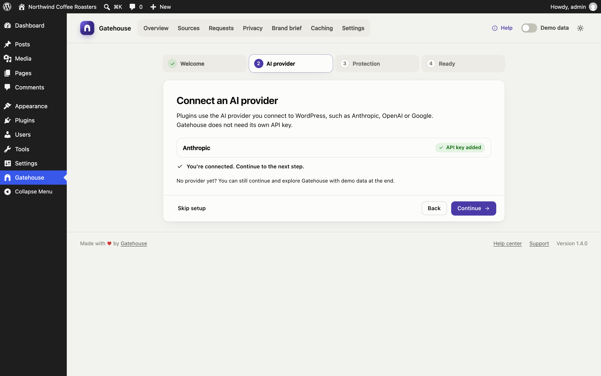
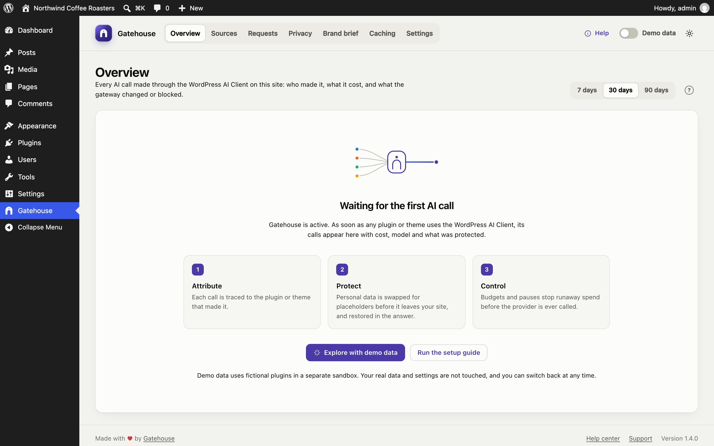
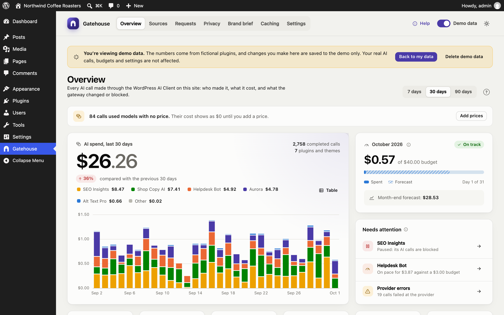
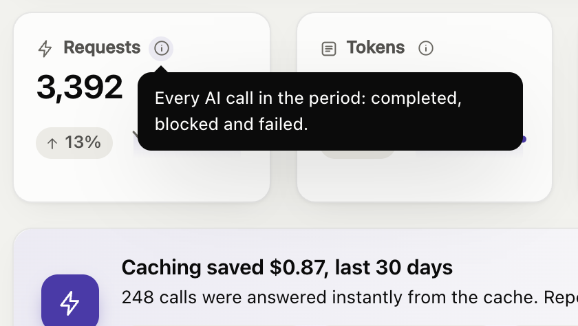
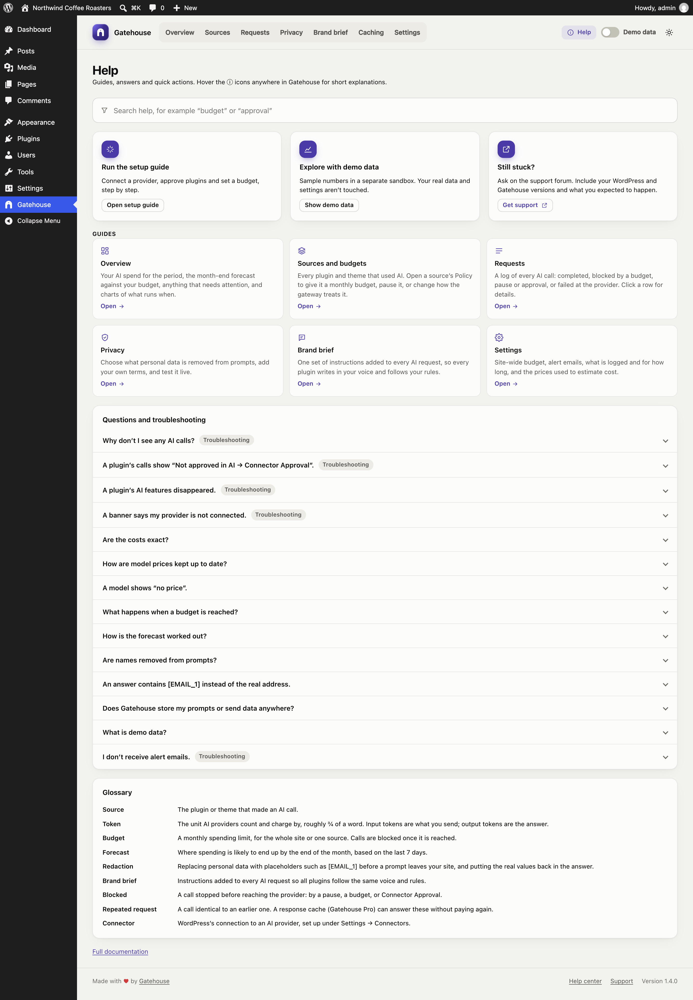
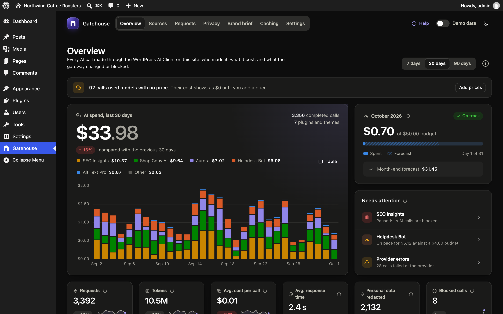
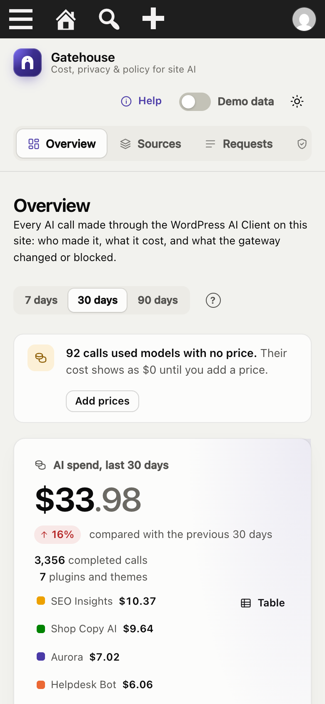

# Getting started

## Requirements

- **WordPress 7.0 or later.** Gatehouse relies on the AI Client that WordPress 7.0 added to core.
- **PHP 7.4 or later.**
- **An AI provider connected to WordPress,** such as Anthropic, OpenAI or Google. Providers are installed as plugins (for example *AI Provider for Anthropic*) and connected under **Settings → Connectors**.
- **An administrator account.** Only users who can manage options (administrators) can see Gatehouse or change its settings.

## Install

1. In WordPress, go to **Plugins → Add New**, search for **Gatehouse**, then click **Install** and **Activate**.
   *Or* upload `gatehouse.zip` under **Plugins → Add New → Upload Plugin**.
2. A new **Gatehouse** item appears in the admin menu.

There is nothing else to set up. Gatehouse starts watching AI calls as soon as it is active.

## Connect an AI provider (if you haven't already)

Gatehouse does not call AI itself and does not need its own API key. It works with the provider you connect to WordPress.

1. Install a provider plugin, such as *AI Provider for Anthropic*, *AI Provider for OpenAI* or *AI Provider for Google*.
2. Go to **Settings → Connectors** and add your API key.

If no provider has an API key yet, the Overview shows a banner with a link to Connectors. See [Troubleshooting](troubleshooting.md#a-banner-says-the-provider-is-not-connected).

## The setup guide

After you activate Gatehouse, a short setup guide opens. It takes about two minutes:

1. **Welcome:** what Gatehouse does.
2. **Connect an AI provider:** shows each installed provider and whether it has an API key. If none does, it walks you through installing a provider plugin and adding the key, with buttons that open the right screens. Click **Check again** when you're done.
3. **Approve plugins that use AI:** shown only if your site uses the AI plugin's Connector Approval feature. See [Connector Approval](#connector-approval).
4. **Protect your site:** a monthly budget for the whole site, budget alert emails, and personal-data redaction.
5. **Ready:** go to your dashboard, or explore with demo data.

**Skip setup** closes the guide. You can reopen it any time from **Help → Run the setup guide**.

## Connector Approval

Some sites use the official **AI** plugin's *Connector Approval* feature. It requires an administrator to approve each plugin before that plugin can use AI. When it is on:

- **Calls from unapproved plugins are blocked.** Gatehouse logs them as **Blocked**, with the note *"Not approved in AI → Connector Approval"*.
- **The Overview names the plugins waiting for approval,** with a **Review approvals** button that opens **Tools → Connector Approval**.
- **Gatehouse itself never needs approval,** because it never calls AI. If you see "Gatehouse" on the approval screen (versions before 1.2 could trigger this when checking providers), you can deny or ignore it.

## Your first day

Until a plugin or theme makes its first AI call, the Overview shows a short explanation and two buttons: **Explore with demo data** and **Run the setup guide**.

After the first call:

- the **[Overview](overview.md)** fills with spend, charts and activity;
- the plugin appears on the **[Sources](sources-and-budgets.md)** page;
- the call appears in the **[Requests](requests.md)** log.

## Explore with demo data

Turn on the **Demo data** switch at the top right of Gatehouse, or click **Explore with demo data**. Gatehouse fills a separate sandbox with about two months of sample traffic from fictional plugins, so you can try every page.

- **Your real data is safe.** Demo data never mixes with your real log, budgets or settings, and real AI calls keep being controlled by your real settings.
- **The banner tells you where you are.** While demo data is on, a banner says so on every page. Changes you make, such as budgets or a brief, are saved to the demo only.
- **Back to my data** switches back. Your demo data is kept for next time.
- **Delete demo data** removes the sandbox completely.

Demo mode is per administrator: other administrators keep seeing real data.

## Help inside the plugin

Click **Help** at the top right of Gatehouse. You'll find:
- search across everything;
- quick actions: re-run setup, demo data, support;
- a guide for every page;
- answers to common questions and troubleshooting;
- a glossary.

On each page, the **?** button next to the page title opens the help for that page. Throughout the dashboard, hover or click an **ⓘ** icon for a short explanation of a term or number.

## Recommended setup

The setup guide covers the essentials. Afterwards:

1. **Give heavy users their own budget.** On **[Sources](sources-and-budgets.md)**, open a plugin's **Policy** and set a monthly budget.
2. **Review privacy.** On **[Privacy](privacy.md)**, add names or terms that must never reach an AI provider, and try the live tester.
3. **Optional: write a brand brief.** On **[Brand brief](brand-brief.md)**, describe your voice and rules.

## Light and dark mode

The button at the top right of Gatehouse cycles between **match system**, **light** and **dark**. Your choice is remembered in your browser.

Gatehouse also works on phones and tablets. The menu scrolls sideways and cards stack:

