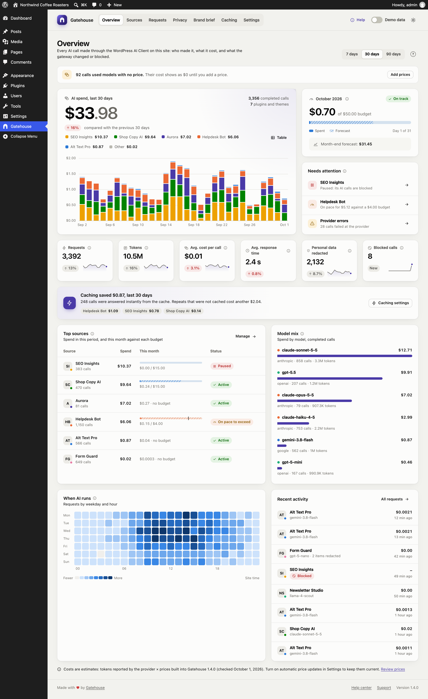
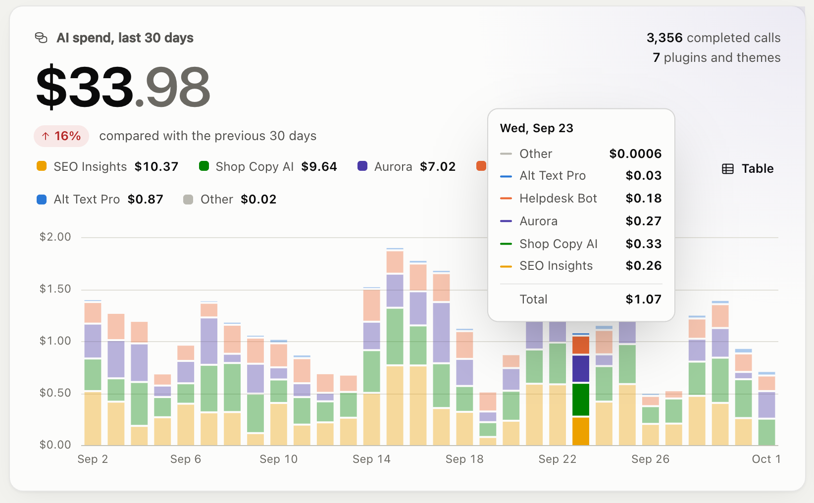
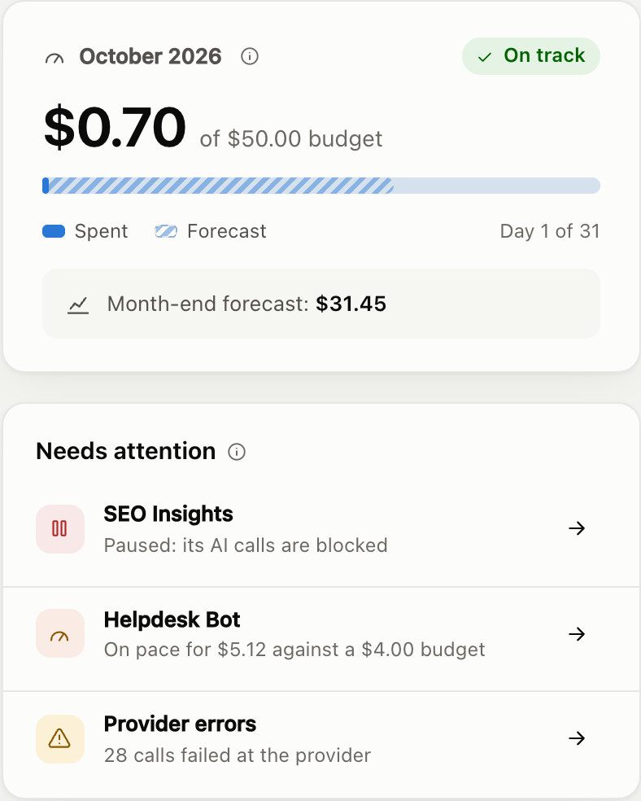

# Overview

The Overview is the first page you see under **Gatehouse**. It answers three questions: how much is AI costing, which plugins are responsible, and does anything need your attention.

## Date range

Use **7 days / 30 days / 90 days** at the top right to choose the period. Everything on the page except the monthly budget card follows this choice. Your choice is remembered in your browser and also applies to the Sources page.

## AI spend

The large card at the top left shows:

- **Total estimated spend** for the period.
- **The change against the previous period of the same length.** Up is shown in red and down in green, because lower spend is better.
- **Completed calls,** and how many plugins and themes made them.
- **A daily chart of spend by source.** Each colored segment is one plugin or theme. The five biggest sources get their own color; the rest are grouped as *Other*.

Ways to read the chart:

- **Hover over a day** (or use the arrow keys after clicking the chart) to see every source's spend that day and the total.
- **Click a name in the legend** to hide or show that source. **Double-click** to show only that source.
- **Click Table** to see the same numbers as a table, one row per day.

Each source keeps its color everywhere in Gatehouse, whichever period you pick.

## This month's budget

The card at the top right always shows the **current calendar month**, whatever date range you picked:

- **Spent so far** this month, and your site-wide budget if you have set one.
- **The budget bar.** The solid part is what you've spent. The striped part is the **forecast**: where spending is likely to end up by the end of the month.
- **Status.** *On track* when the forecast is within the budget, *Over pace* when it isn't.
- **The month-end forecast** in dollars.

The forecast is month-to-date spend plus the average daily spend of the **last 7 days** for each remaining day of the month. Using the last week, rather than the first days of the month, keeps it steady on the 1st and 2nd of a month. See [How costs are calculated](costs-and-pricing.md#forecasts).

No budget yet? The card links to **Settings** so you can set one.

## Needs attention

This list shows anything you might want to act on:

| Item | What it means |
|---|---|
| **Paused** | You paused this source; its AI calls are being blocked. |
| **Reached its monthly budget** | Its calls are blocked until the 1st of next month, or until you raise the budget. |
| **Near its budget** | It has used more than your alert threshold (80% by default). |
| **On pace to exceed** | It is still under budget, but its forecast is over. Act now to avoid a hard stop later in the month. |
| **Provider errors** | Calls that failed at the AI provider, for example because the provider was overloaded. Opens the Requests log. |

Click the arrow on an item to go to the right page. When nothing needs attention, the card says **All clear**.

## Key numbers

The row of six tiles shows, for the selected period:

| Tile | Meaning |
|---|---|
| **Requests** | Every AI call: completed, blocked and failed |
| **Tokens** | Input plus output tokens across completed calls |
| **Avg. cost per call** | Estimated spend ÷ completed calls |
| **Avg. response time** | How long completed calls took, from request to answer |
| **Personal data redacted** | Items replaced with placeholders before leaving your site |
| **Blocked calls** | Calls stopped by a pause or a budget |

Each tile compares with the previous period and shows a small trend line of the last 14 days. A tile shows **New** when there was nothing to compare with.

## Repeated requests and caching

When plugins send exactly the same AI request more than once, a card under the key numbers shows how many calls were repeats, what they cost and which plugins repeat most. Gatehouse spots repeats from a fingerprint of each request; the request text itself is never stored.

- **Without Gatehouse Pro:** the card estimates what a response cache could have saved. Click **×** to hide it.
- **With [Gatehouse Pro](pro.md):** the card shows what caching actually saved, and what uncached repeats still cost.

## Top sources

The plugins and themes with the highest spend in the period. For each one:

- **Spend** in the period.
- **This month:** a budget bar if it has a budget (solid = spent, striped = forecast, tick = budget), or its month-to-date spend if it has none.
- **Status:** Active, On pace to exceed, Near budget, Budget reached or Paused.

**Manage** opens the [Sources](sources-and-budgets.md) page.

## Model mix

Spend by AI model, with the provider, number of calls and tokens. Models without a price say **no price set**; see [Costs and pricing](costs-and-pricing.md#models-without-a-price).

## When AI runs

A heatmap of requests by weekday and hour, in your site's timezone. Darker squares mean more calls. Hover or focus a square for the exact count. It helps you spot scheduled jobs, overnight batch work or unexpected traffic.

## Recent activity

The latest AI calls, with source, model, cost, any redactions and how long ago each happened. **All requests** opens the full [Requests](requests.md) log.

## Banners

Banners at the top of the Overview tell you about problems that affect accuracy or whether AI works at all:

- **AI features are turned off on this site.** Something has disabled the WordPress AI Client.
- **No AI provider is connected** or **…is installed but not connected.** See [Troubleshooting](troubleshooting.md#a-banner-says-the-provider-is-not-connected).
- **Calls used models with no price.** Their cost shows as $0 until you add a price.
- **Built-in model prices are N days old.** Shown when the prices built into the plugin are more than four months old. Update the plugin or review the prices.

The note at the bottom of the page shows which Gatehouse version supplied the prices, and the date they were checked.
