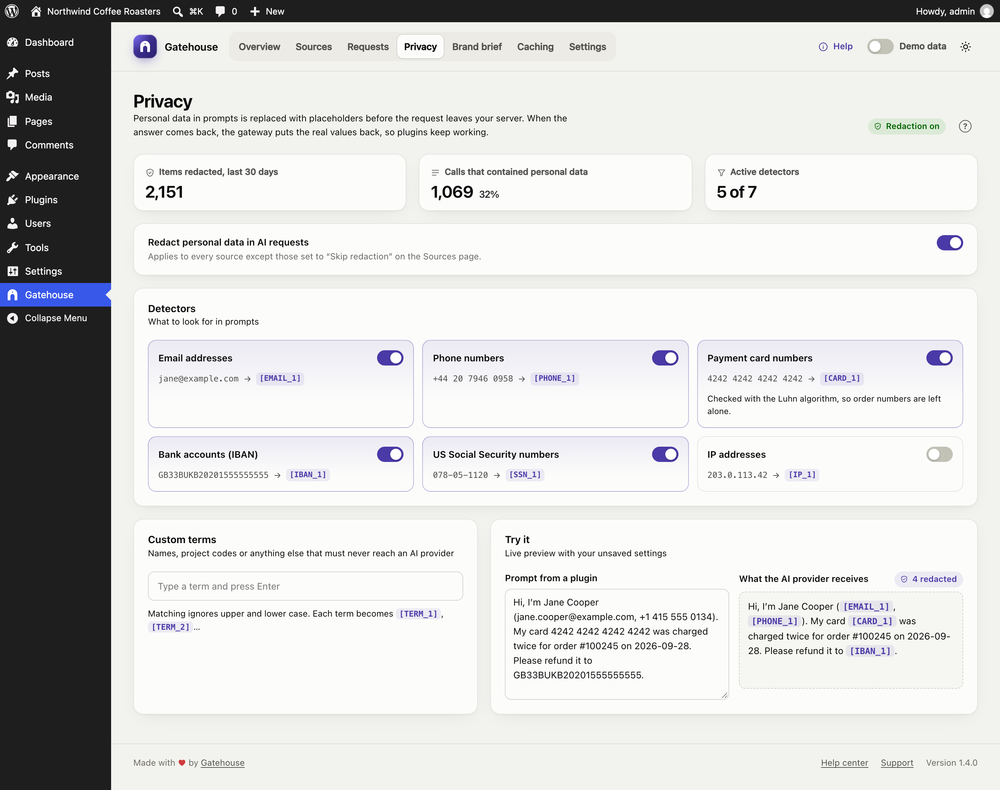
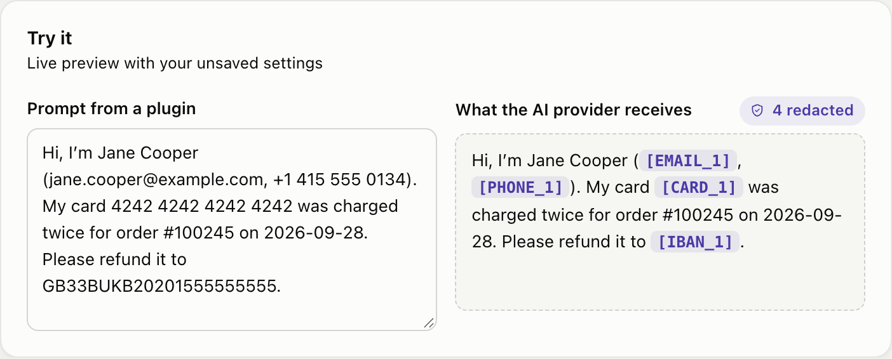

# Privacy and redaction

AI plugins often send customer data to AI providers without you noticing: a support bot forwards a customer's email address, a form plugin sends a phone number. Gatehouse replaces that data with placeholders **before the request leaves your server**, and puts the real values back in the answer.

## How it works

1. A plugin sends a prompt such as:
   *"Reply to Jane at jane@example.com about her order."*
2. Gatehouse changes it to:
   *"Reply to Jane at [EMAIL_1] about her order."*
3. The AI provider only ever sees `[EMAIL_1]`.
4. If the answer mentions `[EMAIL_1]`, Gatehouse swaps the real address back in before the plugin receives the answer.

The plugin works as before, and the provider never received the address.

Details:

- **Consistent placeholders.** Within one request, the same value always gets the same placeholder, so the model can still tell that two mentions refer to the same thing.
- **Exact restoring.** Each distinct value gets its own placeholder, so the original is restored exactly as written. For custom terms, "Project Falcon" and "project falcon" become `[TERM_1]` and `[TERM_2]`.
- **Only text is checked.** Images, files, audio, tool definitions and output formats are left untouched.

## Turning redaction on and off

**Redact personal data in AI requests** controls redaction for the whole site. It is on by default.

To exempt a single plugin, open its policy on the [Sources](sources-and-budgets.md#skip-redaction) page and turn on **Skip redaction**.

## Detectors

Each card is one kind of data, with an example of what it catches. Switch each one on or off.

| Detector | Default | Example | Notes |
|---|---|---|---|
| **Email addresses** | On | `jane@example.com` → `[EMAIL_1]` | |
| **Phone numbers** | On | `+44 20 7946 0958` → `[PHONE_1]` | Grouped numbers with 8–15 digits. Dates (2026-09-28), version numbers (6.4.3) and decimal amounts are left alone. |
| **Payment card numbers** | On | `4242 4242 4242 4242` → `[CARD_1]` | Only numbers that pass the card checksum (Luhn), so order and invoice numbers are not touched |
| **Bank accounts (IBAN)** | On | `GB33BUKB20201555555555` → `[IBAN_1]` | |
| **US Social Security numbers** | On | `078-05-1120` → `[SSN_1]` | Only the `123-45-6789` format |
| **IP addresses** | Off | `203.0.113.42` → `[IP_1]` | Off by default because IP addresses are often harmless in technical prompts |

> **Names are not detected automatically.** Recognising names reliably would mean sending your text to another service. Add the names that matter to you as custom terms.

## Custom terms

Add anything that must never reach an AI provider: key customers, staff names, product code names, internal URLs.

- Type a term and press **Enter** (or a comma) to add it. Click **×** on a term to remove it.
- Matching ignores upper and lower case.
- Each term becomes `[TERM_1]`, `[TERM_2]` and so on, and is restored in the answer.
- Terms must be at least two characters. You can add up to 200.

## Try it

The **Try it** card shows exactly what an AI provider would receive. It uses your current settings, including changes you haven't saved yet.

Paste a prompt on the left. The right side shows the redacted version, with placeholders highlighted and a count of redacted items.

## The numbers at the top

- **Items redacted, last 30 days.**
- **Calls that contained personal data,** and what share of all calls that is.
- **Active detectors,** counting custom terms as one detector.

## Saving

Changes are not applied until you click **Save changes** in the bar at the bottom of the screen. **Discard** undoes them.

## Limits

- Redaction covers calls made through the WordPress AI Client to Anthropic, OpenAI and Google. A developer can add other providers; see [For developers](developers.md#adding-a-provider).
- Placeholders are restored when the answer contains them exactly. If a model rewrites a placeholder (for example "EMAIL 1" without brackets), it can't be restored. If that matters for a plugin, turn on **Skip redaction** for that plugin only.
- Redaction is pattern-based. It greatly reduces what leaves your site but can't guarantee that no personal data is ever sent. Use custom terms for anything sensitive that isn't a standard format.
