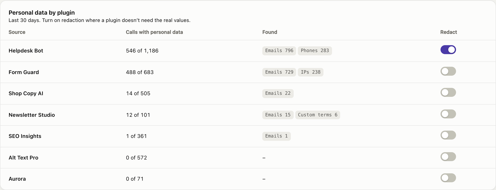
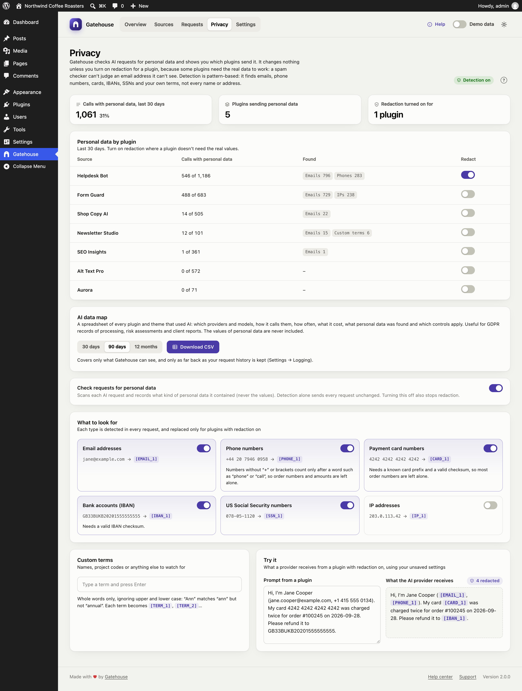
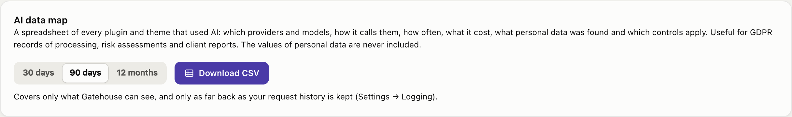

# Privacy

AI plugins often send customer data to AI providers without you noticing. A support bot forwards a customer's email address; a form plugin sends a phone number. Gatehouse checks every AI request it sees for personal data and shows you **which plugins send what**. It changes nothing unless you turn on **redaction** for a plugin.

## Detection and redaction

- **Detection** is on by default. Each request is checked for the kinds of data below. Gatehouse records what kind was found and how much (for example "2 emails"), **never the values**. The request is sent exactly as the plugin wrote it.
- **Redaction** is off by default, and you turn it on per plugin. For those plugins, the values are replaced with placeholders such as `[EMAIL_1]` before the request leaves your server, and put back in the answer.

Why redaction isn't on by default: some plugins need the real data to work. A spam checker can't judge an email address it can't see, and a CRM plugin can't file a contact under `[EMAIL_1]`. Turn redaction on where the plugin doesn't need the values, for example a support reply writer or a content generator.

## Personal data by plugin

For the last 30 days, the report shows each plugin and theme that used AI:

- **Calls with personal data:** how many of its calls contained any, out of all its calls.
- **Found:** the kinds and how many, for example *Emails 794 · Phones 282*.
- **Redact:** the switch that turns redaction on for that plugin.

Changes take effect when you click **Save changes** in the bar at the bottom of the screen. You can also turn redaction on in a plugin's policy on the [Sources](sources-and-budgets.md) page.

The numbers at the top: calls with personal data in the last 30 days (and their share of all calls), how many plugins sent personal data, and how many have redaction on.

## How redaction works

1. A plugin with redaction on sends: *"Reply to Jane at jane@example.com about her order."*
2. Gatehouse changes it to: *"Reply to Jane at [EMAIL_1] about her order."*
3. The AI provider only sees `[EMAIL_1]`.
4. If the answer mentions `[EMAIL_1]`, Gatehouse puts the real address back before the plugin receives it. It also recognises small rewrites such as `[EMAIL 1]` or `[email_1]`.

Within one request, the same value always gets the same placeholder, so the model can still tell that two mentions refer to the same thing. Only text is checked: images, files, audio, tool definitions and output formats are left alone.

## What to look for

Switch each kind of data on or off. A kind that's off is neither detected nor replaced.

| Kind | Default | Example | How it's recognised |
|---|---|---|---|
| **Email addresses** | On | `jane@example.com` → `[EMAIL_1]` | |
| **Phone numbers** | On | `+44 20 7946 0958` → `[PHONE_1]` | Numbers starting with `+` or a bracketed area code. Other grouped numbers count only right after a word such as "phone", "tel", "call", "mobile" or "τηλ.". Amounts such as `12 500 000`, dates and version numbers are left alone. |
| **Payment card numbers** | On | `4242 4242 4242 4242` → `[CARD_1]` | 13 to 19 digits with a known card prefix and a valid checksum, so most order numbers are left alone |
| **Bank accounts (IBAN)** | On | `GB33BUKB20201555555555` → `[IBAN_1]` | Only IBANs with a valid checksum |
| **US Social Security numbers** | On | `078-05-1120` → `[SSN_1]` | Only the `123-45-6789` format |
| **IP addresses** | Off | `203.0.113.42` → `[IP_1]` | Off by default because IP addresses are often harmless in technical prompts |

> **Names and street addresses are not detected.** Recognising them reliably would mean sending your text to another service. Add the names that matter to you as custom terms.

## Custom terms

Add names or words to watch for: key customers, staff, product code names, internal URLs.

- Type a term and press **Enter** (or a comma) to add it. Click **×** to remove it.
- **Whole words only**, ignoring upper and lower case: "Ann" matches "ann" but not "annual" or "planned".
- Each term becomes `[TERM_1]`, `[TERM_2]` and so on when redacted.
- Terms must be at least two characters. You can add up to 200.

## Try it

The **Try it** card shows what an AI provider would receive from a plugin with redaction on, using your current settings, including unsaved changes.

## AI data map

**Download CSV** gives you a spreadsheet of every plugin and theme that used AI in the period you choose (30 days, 90 days or 12 months). For each one it lists:

- its AI providers and models, and how it calls them (WordPress AI Client or directly with its own key);
- calls, blocked calls and estimated cost;
- calls with personal data and the kinds and counts found (never the values);
- whether redaction is on, its monthly budget, hourly limit and paused state;
- its first and last call in the period.

It's useful for records of processing, risk assessments and reports to clients. It only covers what Gatehouse can see, and only as far back as your request history is kept (see [Settings → Logging](settings.md#logging)).

## Turning detection off

**Check requests for personal data** turns detection off for the whole site. With it off, nothing is checked or recorded, and redaction stops for every plugin.

## Limits

- Detection and redaction cover the calls Gatehouse can see: AI Client calls and direct calls to the providers listed in [What Gatehouse can and can't see](getting-started.md#what-gatehouse-can-and-cant-see).
- They are pattern-based. They reduce what leaves your site, but can't guarantee that no personal data is ever sent. Use custom terms for anything sensitive that isn't a standard format.
- If a model rewrites a placeholder beyond recognition, it can't be put back. If that happens with a plugin, turn redaction off for it.
- Redaction doesn't replace your agreement with your AI provider about how they handle the data you send.
