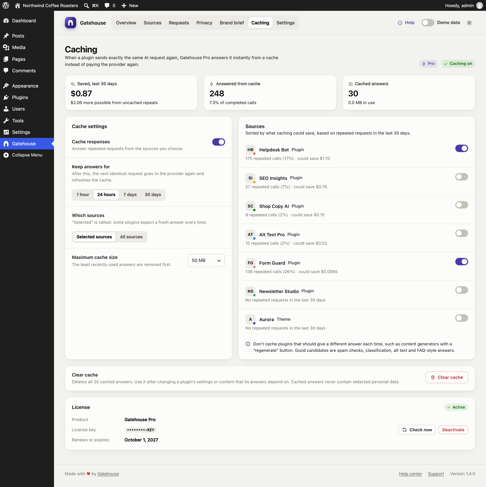
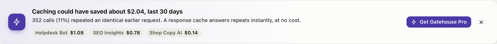
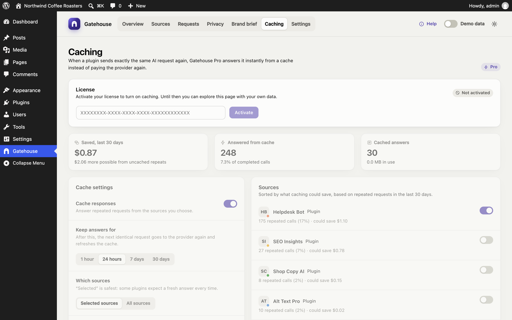
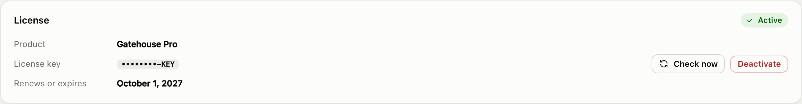
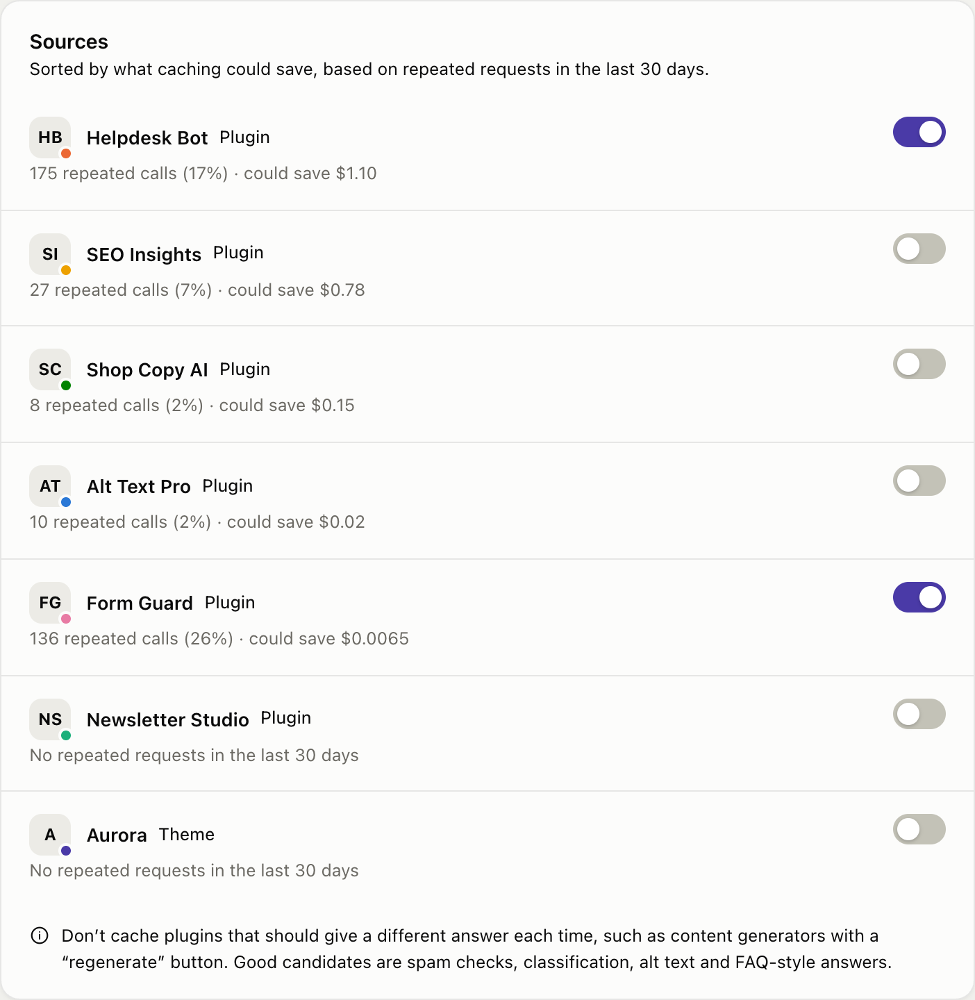
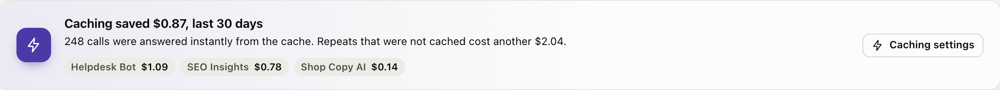
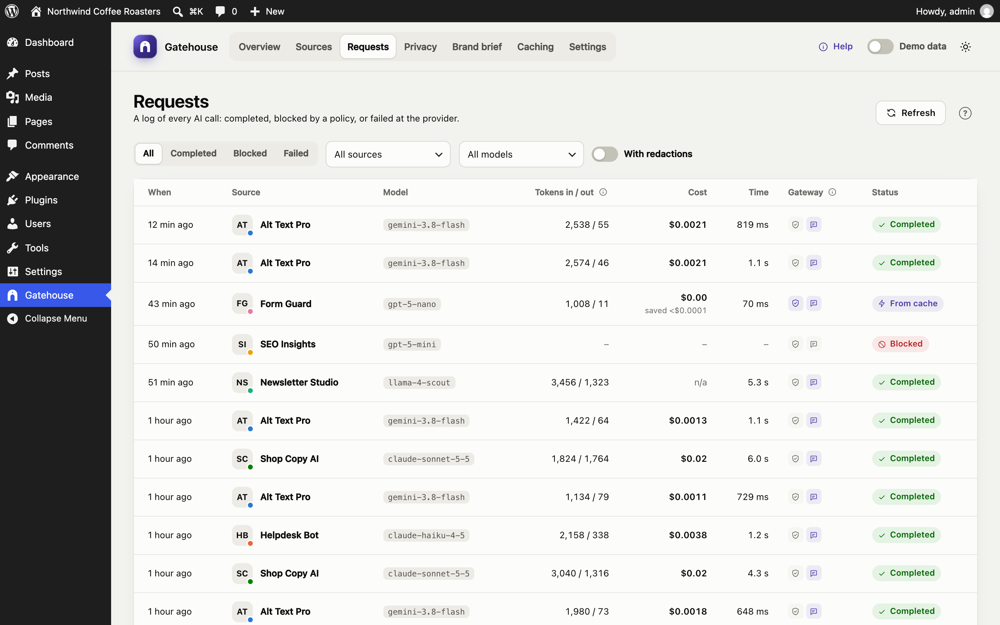

# Gatehouse Pro: response caching

Gatehouse Pro is an optional paid add-on. When a plugin sends **exactly the same AI request again**, Pro answers it from a cache instead of paying the AI provider for the same answer twice.

## Is it worth it for my site?

The free plugin tells you before you buy. On the Overview, Gatehouse shows how many calls repeated an identical earlier request, and roughly what those repeats cost:

Good candidates for caching are plugins that ask the same thing many times:
- spam and moderation checks;
- classification and tagging;
- image alt text;
- FAQ-style support answers;
- translations of fixed strings.

Poor candidates are plugins that should give a **different** answer each time, such as content generators with a "regenerate" button.

To hide the suggestion, click **×** on the card. It stays hidden in that browser.

## Installing Pro

1. Make sure the free **Gatehouse** plugin is installed and active. Pro is an add-on and needs it.
2. Go to **Plugins → Add New → Upload Plugin**, choose `gatehouse-pro.zip` and click **Install Now**, then **Activate**.
3. Open **Gatehouse → Caching**.

## Activating your license

1. Paste the license key from your purchase email into the **License** box.
2. Click **Activate**.

Each activation is tied to one site's domain. To move Pro to another site, click **Deactivate** on the old site first, which frees the activation.

Until the license is activated, the Caching page shows your data but caching stays off.

**How licensing works:**
- **Weekly check.** Pro checks the license with the store once a week. **Check now** checks immediately.
- **Server outages.** If the licensing server can't be reached, Pro keeps working for **14 days** and shows *Active (offline check)*. An outage never switches caching off for you.
- **Expiry.** If a license expires or is disabled, caching stops, and the free features keep working as normal. Renew and click **Check now** to turn caching back on.

## Turning on caching

Caching is switched on by default, but **no plugin is cached until you choose it**, because some plugins need a fresh answer every time.

The **Sources** list is sorted by what caching could save, based on each source's repeated requests in the last 30 days. Each row shows:
- the number of repeated calls;
- the share of that source's calls that were repeats;
- the potential saving.

The top source is marked **Recommended**.

1. Switch on the sources you want cached.
2. Click **Save changes** in the bar at the bottom of the screen.

### Cache settings

| Setting | What it does |
|---|---|
| **Cache responses** | The master switch |
| **Keep answers for** | 1 hour, 24 hours (default), 7 days or 30 days. After that, the next identical request goes to the provider and refreshes the cache. |
| **Which sources** | **Selected sources** (default, recommended) or **All sources** |
| **Maximum cache size** | 25, 50 (default), 100 or 250 MB. When full, the least recently used answers are removed first. |

## How caching works

1. A plugin asks for AI. Gatehouse redacts personal data and adds your brand brief, as usual.
2. Pro looks for an earlier request that was **exactly** the same. The match covers the model, settings, instructions and text.
3. **Found:** Pro returns the stored answer immediately. Nothing is sent to the provider and nothing is charged.
4. **Not found:** the request goes to the provider as normal, and Pro stores the answer for next time.

Only successful text answers are cached. Errors, images and audio never are.

### Privacy

Pro stores answers **after** redaction and **before** Gatehouse puts the personal data back. So:

- **No redacted personal data in the cache.** It only ever holds placeholders such as `[EMAIL_1]`.
- **Correct answers for each person.** Two requests that differ only in personal data (say, the same spam check on two different email addresses) share one cached answer. Each one is then restored with its **own** values: the first person's data is never shown in the second answer.

If you turned on **Skip redaction** for a source, its prompts and answers are cached as they are. Bear this in mind before caching such a source.

## Seeing the savings

- **Overview:** the savings card shows what caching saved in the selected period, and what uncached repeats still cost:

  

- **Caching page:** money saved in the last 30 days, calls answered from the cache (with the share of all calls), and the cache's current size.
- **Requests:** cached calls show **From cache**, a cost of $0.00 and the amount saved. The response time shows how fast cached answers are.

Cached calls don't count towards budgets, because they cost nothing.

## Clearing the cache

Under **Clear cache**, click the button, then **Click again to confirm**. Clear the cache when a plugin's answers should change: for example, after you edit FAQ content that a support bot answers from, or after you change your brand brief.

## Updates

Pro updates through **Dashboard → Updates** like any other plugin, as long as your license is active.

## Uninstalling Pro

- **Deactivating** Pro stops caching but keeps your license and cached answers.
- **Deleting** Pro removes the cache table, its settings and the stored license. Click **Deactivate** in the License card first if you want to free the activation for another site.

## For developers

| Hook | Purpose |
|---|---|
| `gatehouse_pro_license_active` (filter) | Override whether Pro is unlocked, for example on a staging copy |
| `gatehouse_record_row` (filter, in Gatehouse) | How Pro marks a call as cached; available to any add-on |
| `gatehouse.routes` (JavaScript filter, in Gatehouse) | How Pro adds the Caching page; available to any add-on |

**REST routes** live under `/wp-json/gatehouse-pro/v1` and all require `manage_options`:
- `GET /status`;
- `POST` and `DELETE /license`;
- `POST /license/check`;
- `POST /settings`;
- `DELETE /cache`.
