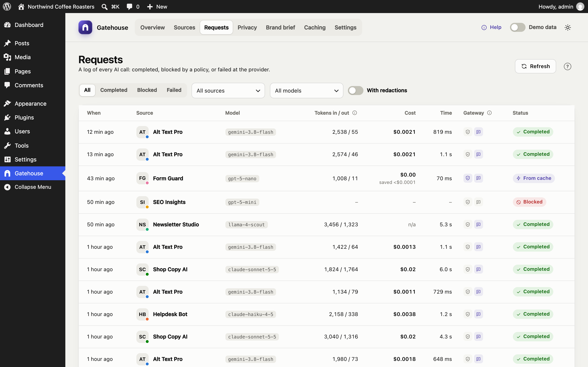
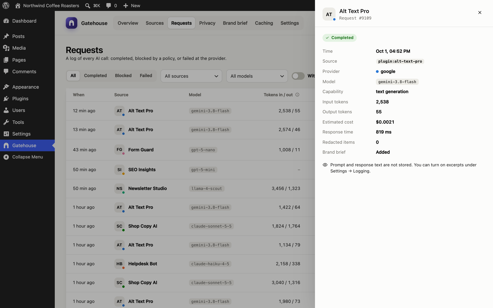

# Requests

The Requests page is a log of every AI call on your site, newest first.

## Columns

| Column | Meaning |
|---|---|
| **When** | How long ago the call was made. Hover for the exact time. |
| **Source** | The plugin or theme that made the call |
| **Model** | The AI model that answered |
| **Tokens in / out** | Tokens sent and tokens received (output includes any "thinking" tokens the model reports) |
| **Cost** | Estimated cost. **n/a** means the model has no price yet. |
| **Time** | How long the provider took to answer |
| **Gateway** | Two icons: the shield lights up when personal data was redacted; the speech bubble lights up when the brand brief was added |
| **Status** | **Completed**, **Blocked** (stopped by a pause or budget) or **Failed** (the provider returned an error) |

## Filters

Filters sit in one row above the table and work together:

- **All / Completed / Blocked / Failed:** filter by status.
- **All sources:** show one plugin or theme.
- **All models:** show one model.
- **With redactions:** only calls where personal data was replaced.
- **Clear filters** resets them.

Use **Refresh** to load calls made since you opened the page. Use **Previous / Next** at the bottom to page through the log, 25 calls at a time.

## Request details

Click any row, or select it and press Enter, to open its details.

The panel shows the time, source, provider, model, capability (for example text generation), input and output tokens, estimated cost, response time, how many items were redacted and whether the brand brief was added.

- **Blocked calls** show why, for example *Monthly budget reached* or *Source is paused*.
- **Failed calls** show the provider's error, for example *HTTP 529: Overloaded*.

### Prompt and response text

By default Gatehouse **does not store** prompt or response text, only the facts above. If you need the text for debugging, turn on **Store prompt and response excerpts** in [Settings](settings.md#logging). The first 1,000 characters of each prompt (as sent, after redaction) and each response are then shown here for new calls.

## How long calls are kept

Calls are kept for 90 days by default (30, 90, 180 or 365 days; see [Settings](settings.md#logging)), then deleted automatically once a day.
