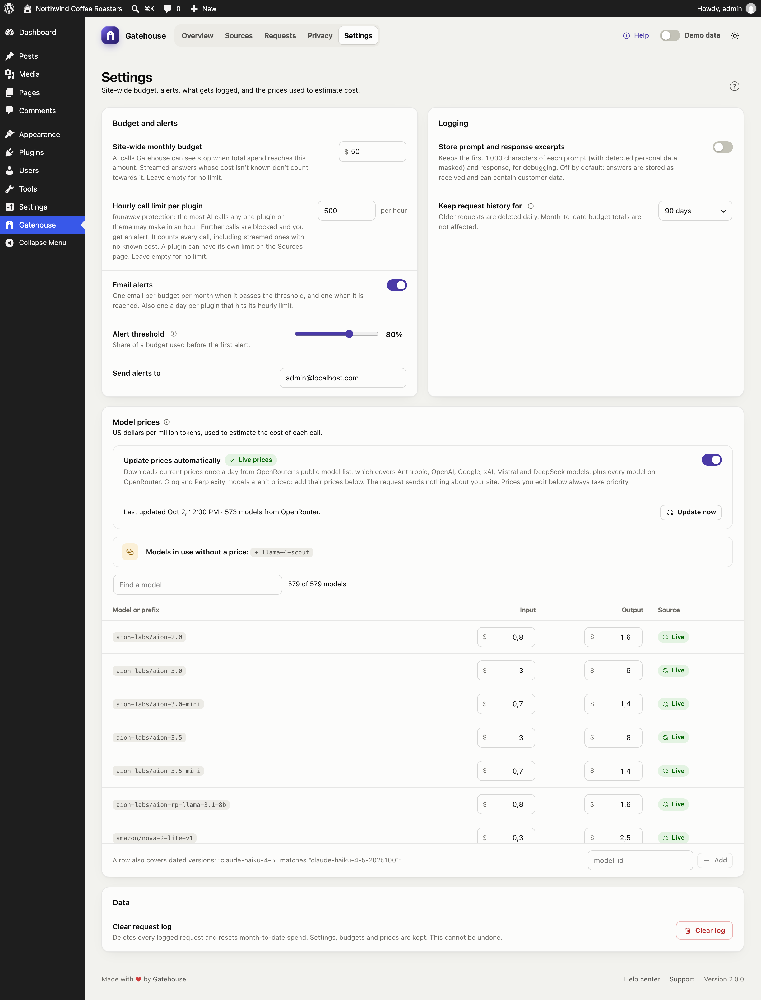

# Settings

Changes on this page are saved when you click **Save changes** in the bar at the bottom of the screen. **Discard** undoes them. If you try to leave with unsaved changes, your browser warns you.

## Budget and alerts

### Site-wide monthly budget

The most your whole site may spend on AI in a calendar month, in US dollars. When total spend reaches it, every AI call Gatehouse can see is blocked until the 1st of next month or until you raise the budget. Leave it empty for no limit.

This works alongside per-source budgets on the [Sources](sources-and-budgets.md) page. A call is blocked if either limit is reached. Calls whose cost isn't known (streamed answers a plugin reads itself) don't count towards it.

### Hourly call limit per plugin

Runaway protection: the most AI calls any one plugin or theme may make in an hour. Further calls are blocked, and you get one alert email a day per plugin that hits it. It counts every completed or failed call, including streamed ones whose cost isn't known. A plugin can have its own limit on the [Sources](sources-and-budgets.md#hourly-call-limit) page. Leave it empty for no limit, and set it well above normal use.

### Email alerts

When on, Gatehouse emails you:

- once when a budget passes the alert threshold, and once when it is reached (the site-wide budget and each source's budget, at most once per budget per month);
- once a day per plugin that hits its hourly limit;
- once a day per plugin whose activity or spending is far above its normal level (see [Alerts](sources-and-budgets.md#alerts)).

### Alert threshold

The share of a budget that triggers the first alert: 50% to 95%, 80% by default. Sources above it also show **Near budget**.

### Send alerts to

The email address for alerts. It defaults to the site administrator's email. Alerts are sent with WordPress's normal email system. If you don't receive them, see [Troubleshooting](troubleshooting.md#i-dont-receive-alert-emails).

## Logging

### Store prompt and response excerpts

Off by default. When on, Gatehouse keeps the first 1,000 characters of each prompt and each response, shown in the [Requests](requests.md#prompt-and-response-text) details. It only applies to calls made after you turn it on.

Personal data Gatehouse detects is masked in the stored prompt. Responses are stored as received. Turn it on only while you need it for debugging: prompts and answers can contain customer data detection didn't catch.

### Keep request history for

30, 90 (default), 180 or 365 days. Older calls are deleted automatically once a day. Month-to-date budget totals are kept separately, so pruning old calls never resets a budget.

## Model prices

Gatehouse estimates each call's cost from the tokens it used and this price table. Prices are in **US dollars per million tokens**, with separate input and output prices.

### Update prices automatically

When on, Gatehouse downloads current prices once a day from OpenRouter's public model list. It covers Anthropic, OpenAI, Google, xAI, Mistral and DeepSeek models under their own names, and every model on OpenRouter under OpenRouter's names (for example `anthropic/claude-sonnet-5.5`). Groq and Perplexity models aren't covered: add their prices yourself. Nothing about your site is sent.
- The line below the switch shows when prices were last updated and how many models were included.
- **Update now** downloads immediately.
- If a download fails, the error is shown and the last good prices stay in use.

When off, the built-in prices are used. The line shows the Gatehouse version they came from and when they were checked. See [How costs are calculated](costs-and-pricing.md#where-prices-come-from).

### The price table

Each row shows its **Source**:
- **Live:** downloaded automatically;
- **Built-in:** shipped with the plugin;
- **Edited:** a live or built-in price you changed;
- **Custom:** a model you added.

Use **Find a model** to search the table.

### Editing prices

- **Change a price:** type into the Input or Output box. The row becomes **Edited**. **Reset** returns it to the live or built-in price.
- **Add a model:** type its ID in the box at the bottom (for example `llama-4-scout`) and click **Add**, then enter its prices. Added rows show **Custom**. **Remove** deletes them.
- **Models in use without a price:** a banner lists every model your site has used that has no price. Click **+ model** to add it as a row.

Your edits are kept when the plugin updates, and always take priority over live and built-in prices.

### How a row matches a model

A row matches a model ID when the ID is exactly the row's name, or starts with the row's name followed by a dash. If several rows match, the longest one wins. So:

- `claude-haiku-4-5` also covers the dated version `claude-haiku-4-5-20251001`;
- `claude-opus-5-5` wins over `claude-opus-5` for Claude Opus 5.5.

Unknown versions are never guessed. `gpt-5` does **not** match `gpt-5.6`, so `gpt-5.6` shows **no price** until you add it.

New prices apply to calls from then on. Calls already logged keep the cost recorded at the time.

## Data

### Clear request log

Deletes every logged call and resets month-to-date spend. Click the button, then **Click again to confirm** within four seconds. Settings, budgets, limits and prices are kept. This can't be undone.

> Clearing the log also resets this month's spend to zero, so any source that had reached its budget can make calls again.
