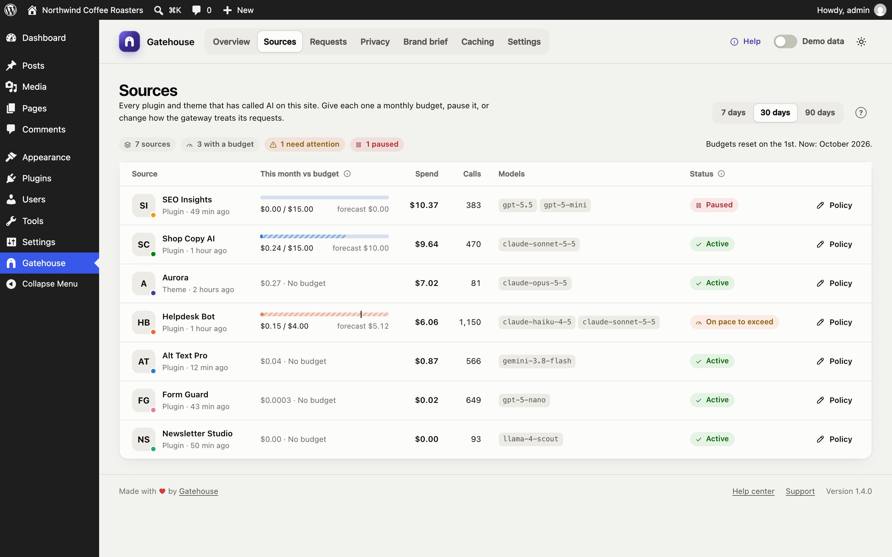
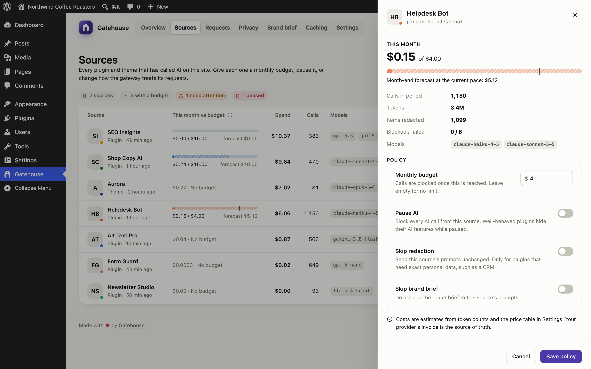

# Sources and budgets

A **source** is a plugin, theme or must-use plugin that has made an AI call through WordPress. The Sources page lists every one, so you can see what each costs and decide how much it may spend.

## How Gatehouse knows which plugin made a call

When a call starts, Gatehouse looks at which plugin's or theme's code asked for it. It ignores the AI provider plugins themselves and Gatehouse, because they only carry the request. Calls that don't come from any plugin or theme are shown as **WordPress core**.

Names come from each plugin's or theme's own header. If you later delete a plugin, its past calls keep its name.

## The table

| Column | Meaning |
|---|---|
| **Source** | Name, type (Plugin, Theme, Must-use plugin) and when it last made a call |
| **This month vs budget** | Month-to-date spend against its budget, with the month-end forecast |
| **Spend** | Estimated spend in the selected period (7, 30 or 90 days) |
| **Calls** | All calls in the period, including blocked and failed ones |
| **Models** | The models it used most |
| **Status** | See below |

The pills above the table count your sources, how many have a budget, how many need attention and how many are paused.

### Statuses

| Status | Meaning |
|---|---|
| **Active** | Under budget and on pace, or no budget set |
| **On pace to exceed** | Under budget now, but the month-end forecast is over it |
| **Near budget** | Has used at least your alert threshold (80% by default) |
| **Budget reached** | Calls are blocked until the 1st of next month or until you raise the budget |
| **Paused** | You paused it; every call is blocked |

## Policies

Click a row, or its **Policy** button, to open the policy panel.

The top of the panel shows this month's spend, the budget bar and forecast, and the source's activity in the selected period: calls, tokens, items redacted, blocked and failed calls, and models.

Below that are four settings. Click **Save policy** to apply them.

### Monthly budget

The most this source may spend in a calendar month, in US dollars. Leave it empty for no limit.

- When the source reaches its budget, Gatehouse **blocks its next calls before they are sent to the provider**, so they cost nothing.
- Budgets reset automatically on the 1st of each month (your site's timezone).
- Raising the budget lifts the block straight away.

### Pause AI

Blocks every AI call from this source, whatever its budget. Use it to stop a misbehaving plugin immediately, or to switch off a plugin's AI features without deactivating the plugin.

### Skip redaction

Sends this source's prompts without replacing personal data. Use it only for plugins that genuinely need exact personal data and send it to a provider you trust, such as a CRM integration. See [Privacy](privacy.md).

### Skip brand brief

Leaves this source's prompts exactly as the plugin wrote them, without adding your [brand brief](brand-brief.md). Use it for plugins whose output must follow their own format, such as translation, code or data extraction.

## What happens when a call is blocked

1. The plugin asks for AI.
2. Gatehouse sees that the source is paused or over budget, or that the site-wide budget is reached.
3. Nothing is sent to the provider and nothing is charged.
4. The plugin receives the same error WordPress gives when AI is unavailable.
5. The call is logged as **Blocked**, with the reason, in [Requests](requests.md).

Plugins that check whether AI is available before showing their AI buttons will **hide those buttons** while a source is blocked. These checks are not logged, so they don't fill your log.

## Budget order

A call is blocked if **any** of these is true, checked in this order:

1. the source is paused;
2. the source has reached its own monthly budget;
3. the whole site has reached its site-wide monthly budget (set in [Settings](settings.md)).

## Alerts

If email alerts are on (in [Settings](settings.md)), Gatehouse emails you:

- once when a source passes the alert threshold (80% by default), and
- once when it reaches its budget.

You get each email at most once per budget per month. The site-wide budget gets the same two emails.
