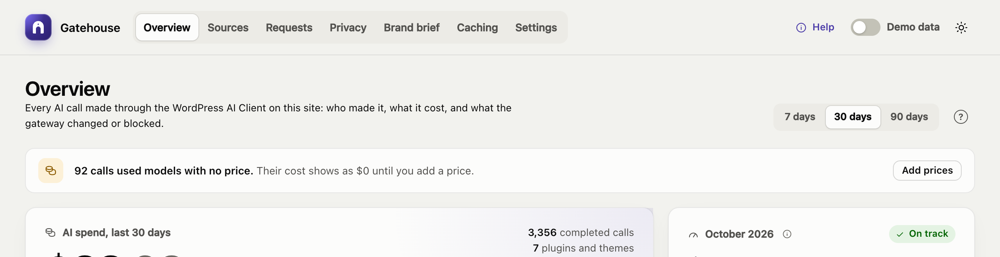

# Troubleshooting

## No AI calls appear

The Overview says **Waiting for the first AI call** even though a plugin has used AI. Check these in order:

1. **Is an AI provider connected?** Look for a banner at the top of the Overview, and check **Settings → Connectors**.
2. **Does the plugin use the WordPress AI Client?** Gatehouse only sees calls made through it. Plugins that call a provider directly with their own API key are invisible to Gatehouse. Ask the plugin's developer whether it uses `wp_ai_client_prompt()`.
3. **Is AI turned off on the site?** A banner says **AI features are turned off on this site** when the `WP_AI_SUPPORT` constant is set to `false`, or when another plugin uses the `wp_supports_ai` filter to disable AI.
4. **Are you looking at the right period?** Pick **30 days** or **90 days** at the top of the Overview.

## A banner says the provider is not connected

- **"No AI provider is connected":** install a provider plugin (for example *AI Provider for Anthropic*) and add its API key under **Settings → Connectors**.
- **"… is installed but not connected":** the provider plugin is installed, but no API key has been added. Add the key under **Settings → Connectors**.

Gatehouse only checks that a key is configured; it never calls the provider to test it. If plugins' calls fail even though a key is added, open a failed call in **Requests**: the provider's error (for example an invalid key or no credit) is shown there.

## Calls are blocked with "Not approved in AI → Connector Approval"

Your site uses the AI plugin's Connector Approval feature, which blocks each plugin until an administrator approves it.

1. Go to **Tools → Connector Approval**. The Overview also shows a **Review approvals** button.
2. Approve the plugin.

Gatehouse itself never needs approval. See [Connector Approval](getting-started.md#connector-approval).

## A plugin's AI features have disappeared

The plugin is probably blocked. On **Sources**, check its status:

- **Not approved:** if the Requests log says *Not approved in AI → Connector Approval*, approve the plugin under **Tools → Connector Approval**.
- **Paused:** open its **Policy** and turn off **Pause AI**.
- **Budget reached:** raise its monthly budget, or wait for the 1st of next month.

Also check the site-wide budget under **Settings**: when it is reached, every plugin is blocked. The **Requests** log, filtered by **Blocked**, shows the reason for each blocked call.

## Costs show $0 or "n/a"

The model has no price. See [Models without a price](costs-and-pricing.md#models-without-a-price).

## Costs don't match my provider's invoice

Gatehouse's costs are estimates. Common reasons for a difference:

- **Your provider changed a price.** Turn on automatic price updates (or click **Update now**), or edit the price under **Settings → Model prices**.
- **Discounts:** prompt caching, batch processing or a negotiated rate. Enter your effective price under **Settings → Model prices**.
- **Calls Gatehouse can't see:** plugins that call the provider directly, or other websites and apps using the same API key.
- **Billing periods and timezones:** your provider may bill in UTC; Gatehouse uses your site's timezone.

## Automatic price updates fail

**Settings → Model prices** shows the error under the switch. The last prices that downloaded successfully stay in use, so cost estimates keep working.

- **"Could not … / timed out":** your server can't reach `openrouter.ai`. Some hosts block outgoing requests; ask your host to allow it, or turn automatic updates off and use the built-in prices.
- **"Empty or in an unexpected format":** the price list changed format. Keep Gatehouse updated; the built-in prices are used as a fallback meanwhile.

## Answers contain placeholders such as [EMAIL_1]

Gatehouse puts real values back when the answer contains a placeholder exactly as sent. If a model changes a placeholder (for example to "EMAIL 1" or "email_1"), it can't be restored.

To fix it for one plugin, turn on **Skip redaction** in its policy on **Sources**. To check what a plugin is sending, temporarily turn on excerpts under **Settings → Logging** and open the call in **Requests**.

## Something that isn't personal data was redacted

- **Numbers:** the phone detector ignores dates, version numbers and decimals, but some codes formatted like phone numbers (for example `020 7946 0958`) will still be replaced. If this affects a plugin, switch off **Phone numbers** under **Privacy**, or turn on **Skip redaction** for that plugin.
- **Custom terms** match anywhere, ignoring case, including inside longer words. Make terms specific: "Falcon Project" rather than "Falcon".

Use the **Try it** box on the Privacy page to test any text.

## I don't receive alert emails

- **Check Settings:** **Email alerts** must be on and the address correct.
- **Each alert is sent once per budget per month.** If you already received the 80% email this month, you won't get it again.
- **Check WordPress email itself:** alerts use WordPress's normal email system. If other WordPress emails (such as password resets) also don't arrive, install an SMTP plugin to send mail through a proper email service.

## The forecast looks too high or too low

The forecast uses the last 7 days' average. A one-off spike, such as a bulk job that generated 500 product descriptions, raises the forecast for a week. Brand-new sources have little history, so their forecast moves a lot at first.

## Old plugins still appear on Sources

Sources stay listed while they have calls in the selected period, or a saved policy. They disappear once their calls age out of the period. If a deleted plugin had a policy, clear its budget and switches.

## The Gatehouse page is blank or doesn't load

- **Reload the page.** If it still fails, open your browser's developer console and look for errors.
- **Check that the plugin files are complete.** The `build/` folder must exist. If you installed from source code rather than a release zip, run `npm install && npm run build`.
- **Check security plugins and firewalls.** The dashboard loads its data from the WordPress REST API (`/wp-json/gatehouse/v1/…`). If a security plugin or firewall blocks the REST API for logged-in admins, the dashboard can't load.
- **Check your role.** Only administrators can open Gatehouse.

## Still stuck?

When asking for help, include:
- your WordPress, PHP and Gatehouse versions;
- which AI provider plugin you use;
- what you expected and what happened;
- any error from **Requests → request details** or your browser console.
